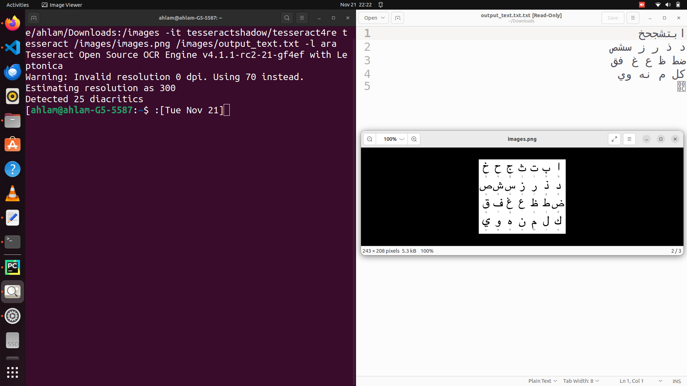

# Arabic-OCR-docker-container
1-pull tesseract image to use it in arabic alphabit detection
```bash
docker pull tesseractshadow/tesseract4re
```
2-run container
```bash
sudo docker run -v /home/ahlam/Downloads:/images -it tesseractshadow/tesseract4re tesseract /images/images.png /images/output_text.txt -l ara
```
here <br>
1-/home/ahlam/Downloads the path of image on my local machin mounted it using volum to /images  inside the container.<br>
2-tesseract: command <br>
3-images.png:is the name of image <br>
/images/output_text.txt: output file you will find it where you mount the volume which is /home/ahlam/Downloads<br>
___

 

